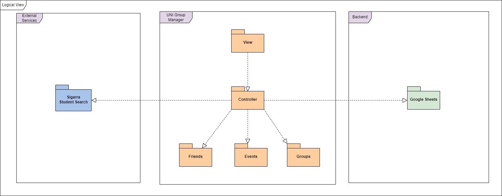
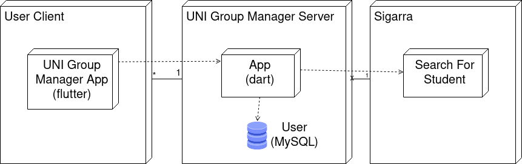
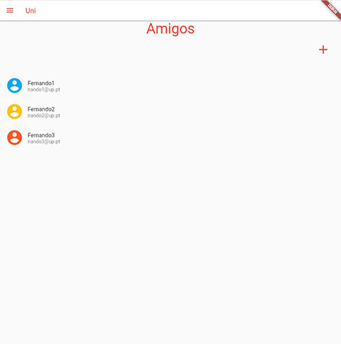
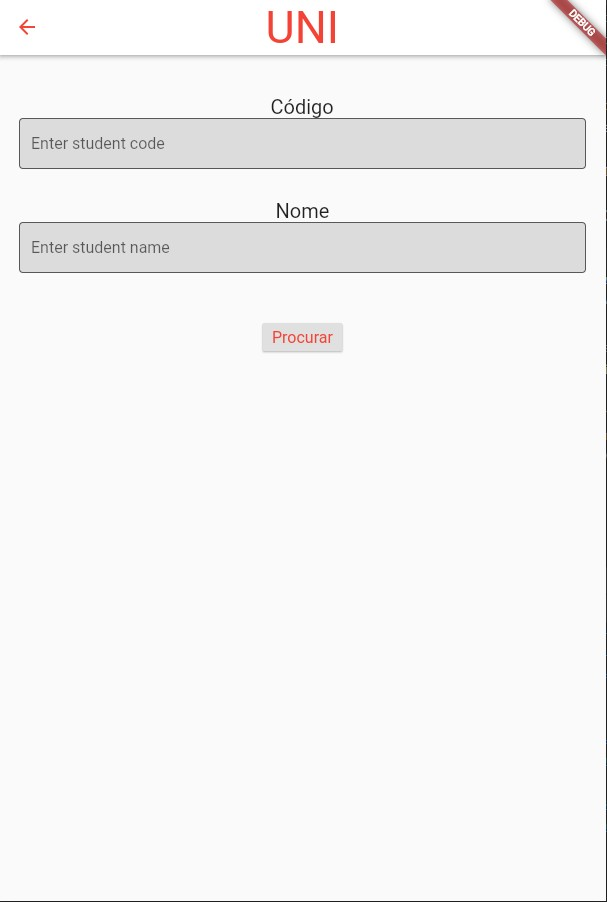
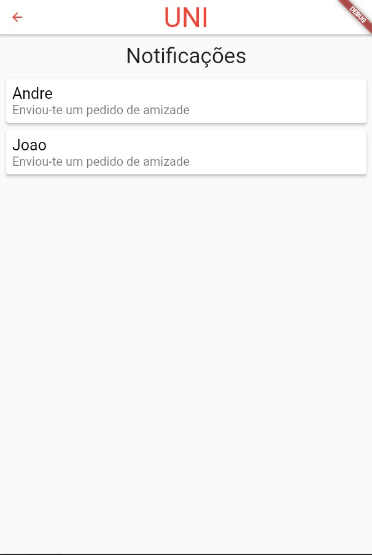

# Architecture and Design

The following topics refer to the logical and physical architecture, which will show the connection between each component and the used technologies.

## Logical architecture

* `UI`: This module is responsible for creating the different menus for the new features that we will add to the UNI app.

* `App Logic`: This module is responsible for managing the main menus that we will add, also the logic pertaining to the other packages.

* `Friends`: This module is responsible for saving the friends list of each user, for adding new friends and its methods.

* `Event`: This module is responsible for saving the list of different events that each user will create for each group its methods.

* `Group`: This module is responsible for saving the list of groups that each user will have and its methods.

* `Sigarra's Student Search`: This module makes it possible for us to acess the Student Search feature available in the Sigarra website, making it possible for us to create the search bar in the UNI app to look up different students for the users to add as friends.

* `Database Server`: This module corresponds to a database server that we will create for us to test our app as we develop the project.

### Package Diagram

    

 

### Physical architecture

Our app's physical architecture is composed by 3 entities: 
* The User Client is the main app, will be running on the user terminal (smartphone). Flutter will be used to develop this, with dart as the programming language.
* The UNI Group Manager Server is responsible for managing the user's data, constituted by an App, which will be simulated inside flutter, and a database. Furthermore, the server's app work as a middle man between the User Client and Sigarra. The server app will be developed using dart, and will be complemented by the User database, running MySQL.
* The Sigarra will be used only as a search tool, more specifically, when searching for a student, the Sigarra's "Pesquisa de Estudantes" (Search for Student) will be used.

    

 

***Note:*** Ideally, the "Uni Group Manager Server" and the "Sigarra" portions of the app would be implemented as described. However, to facilitate development and to allow a demonstration without the required backend, the features that they would be responsible for will be implemented using Google Sheets and its Dart API. 
 

### Vertical prototype

- ##### Friends List Page
    - A prototype of the screen listing all the friends of the user, using static examples of friends, has been implemented, as well as an icon that will serve as an add friend button in the future.
    - User Interface Snapshot:
    

    
    

- ##### Friend Search Page
    - A prototype of the screen for the form where the user inputs the student code or the student name of the user they want to add.
    - User Interface Snapshot:
    

    
    

- ##### Notification List Page
    - A prototype of the screen listing all the notifications the user has, using static examples of notifications.
    

    
    
