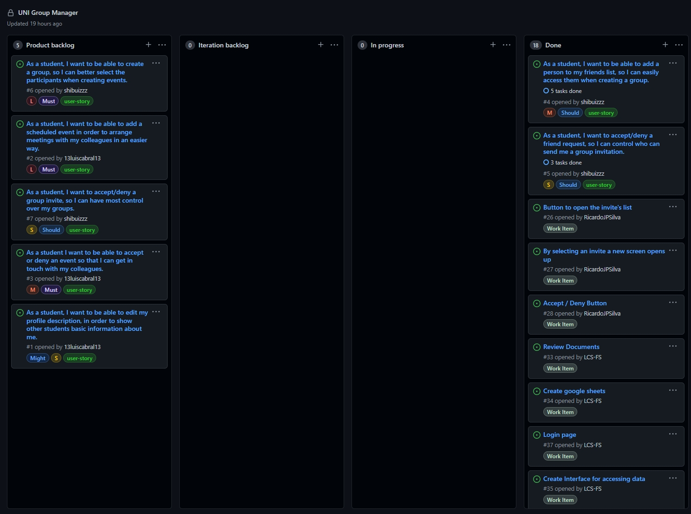

# Iteration 1

## Release [v1](https://github.com/LEIC-ES-2021-22/2LEIC11T1/releases/tag/v1)

 

## Iteration Retrospective

### a) What went well
&nbsp; &nbsp; &nbsp; &nbsp; Selection of the user stories and work items to implement during this iteration. Neither did they feel like too many or too few for the given time frame. As such we managed to complete all the selected objectives, as is shown in the Project Board.
 
&nbsp; &nbsp; &nbsp; &nbsp; Implementation of the methods of the gsheets interface that were required for the iteration.

### b) What should we do differently
&nbsp; &nbsp; &nbsp; &nbsp; Better communication between group members to assure that there is one clear vision of the desired results.
 &nbsp; &nbsp; &nbsp; &nbsp; More detailed work items to make sure that there is no confusion and to avoid multiple people doing the same thing parallellely.
  &nbsp; &nbsp; &nbsp; &nbsp; Start implementing the work items sooner, to avoid last minute crunches.

### c) What still puzzles us
&nbsp; &nbsp; &nbsp; &nbsp; Implementation of Gherkin Acceptance tests without clear examples. 
&nbsp; &nbsp; &nbsp; &nbsp; Unit tests of the interface that access and change data in gsheets and require specific static data for the success of the tests.

## Project Board
  
