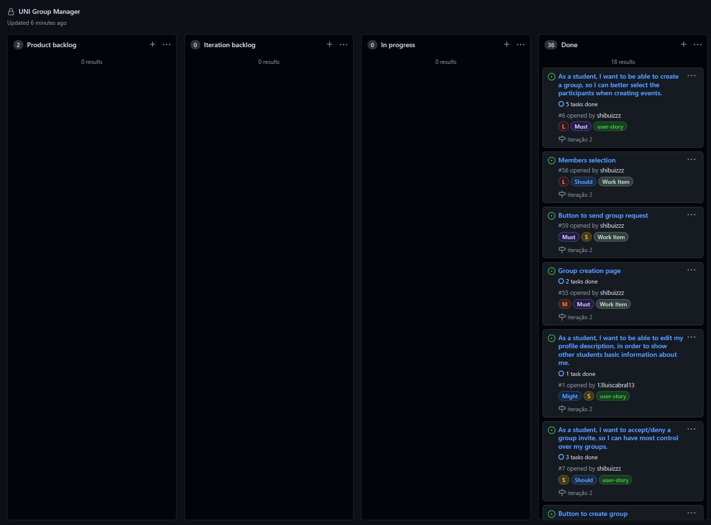

# Iteration 2

## Release [v2](https://github.com/LEIC-ES-2021-22/2LEIC11T1/releases/tag/v2)

 

## Iteration Retrospective

### a) What went well
&nbsp; &nbsp; &nbsp; &nbsp; Integration with Uni_for_all.
 
&nbsp; &nbsp; &nbsp; &nbsp; Restructure of google sheets database to reduce total number of sheets.
 
&nbsp; &nbsp; &nbsp; &nbsp; Streamlining of google sheets interface.

### b) What should we do differently
&nbsp; &nbsp; &nbsp; &nbsp; Better planning and time management.
 
&nbsp; &nbsp; &nbsp; &nbsp; Team communication.

### c) What still puzzles us
&nbsp; &nbsp; &nbsp; &nbsp; Gherkin acceptance tests.

## Project Board
  
