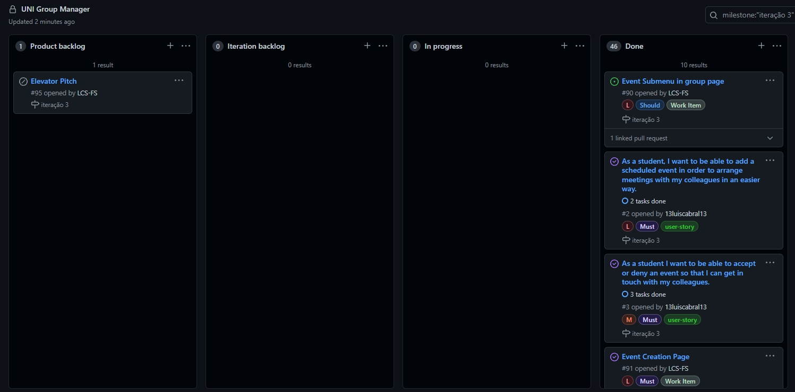

# Iteration 3

## Release [v3](https://github.com/LEIC-ES-2021-22/2LEIC11T1/releases/tag/v3)

 

## Iteration Retrospective

### a) What went well
&nbsp; &nbsp; &nbsp; &nbsp; Time management.
 
&nbsp; &nbsp; &nbsp; &nbsp; Overall developement during this iteration.

### b) What should we do differently
&nbsp; &nbsp; &nbsp; &nbsp; Scrollable pages from the beggining.
 

### c) What still puzzles us
&nbsp; &nbsp; &nbsp; &nbsp; Tests envolving data retrieval from Google Sheets  

## Project Board
  