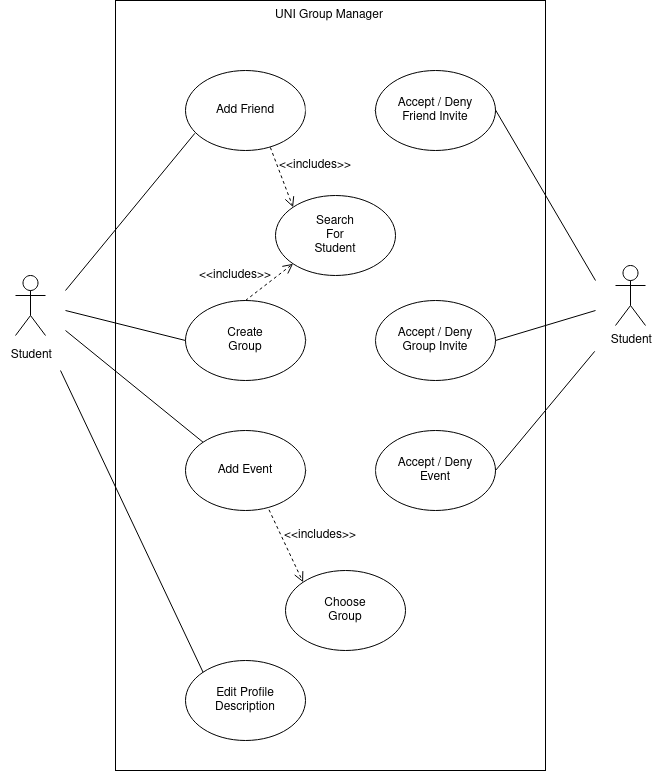
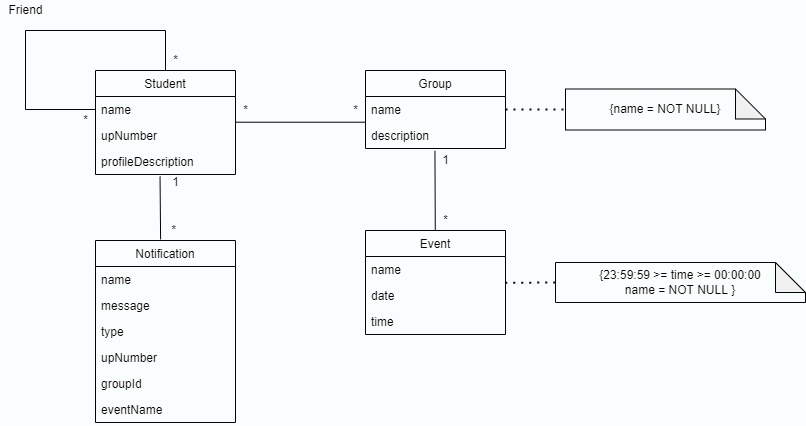

# Requirements

## Use case model

    

 

## Add Friend

|||
| --- | --- |
| *Name* | Add Friend |
| *Actor* |  Student A | 
| *Description* | The Student A adds Student B to his friends list, searching for their name or numerical code, and said friend receives a notification in order to accept or deny the friend invite. |
| *Preconditions* | - Both students are registed in sigarra's database.   - Both students use the app. |
| *Postconditions* | - The Students may get added to each others friends list, depending on if the invite is accepted or not. |
| *Normal flow* | 1. Student A presses the menus button (3 lines in the top left corner).   2. Student A selects the option "Amigos"   3. System shows the friends list and an add button.   4. Student A presses the add button   5. System shows the <b>Search for Student</b> feature.   6. Student A fills any of the bars and presses the search button.   7. System shows the search results.   8. Student A presses the desired person and an add button.   9. System sends an Accept / Deny notification to Student B.   10. Students are added to each others Friends list if the request is accepted.|
 

## Search For Student

|||
| --- | --- |
| *Name* | Search For Student |
| *Actor* | Student A |
| *Description* | In order to add a friend, a Student A needs the ability to search for a Student B. |
| *Preconditions* | - Both students are registered in sigarra's database.   - Both students use the app.   - The search string given by Student A must represent either the name/s or number of the Student B. |
| *Postconditions* | - If the searched student is successful found the respective action can be performed. |
| *Normal flow* | 1. Student A enters a valid text in the search camp.   2. A finite number of students is found and displayed. |
| *Alternative flows and exceptions* | 1. [Invalid] Student A enters an invalid text in the search camp.   2. No student is found.|
 

## Accept / Deny Friend Invite

|||
| --- | --- |
| *Name* | Accept / Deny Friend Invite |
| *Actor* |  Student B | 
| *Description* | After Student A sends a Friend Invite to Student B, the actor receives a notification to accept or deny said invite. |
| *Preconditions* | - Both students are registed in sigarra's database.   - Both students use the app.   - Student A sent a friend request to Student B.|
| *Postconditions* | - The Students may get added to each others friends list, depending on if the invite is accepted or not.   - The invite is cleared of the Student B notification's list. |
| *Normal flow* | 1. Student A tries to add Student B as a friend.   2. System sends Student B a notification pertaining to the friend invite.   3. Student B clicks on the notification's list.   4. System shows Student A's profile and the options "Accept" and "Decline".   5. Student B presses the "Accept" option.   6. System adds the students to each others friends lists.
| *Alternative flows and exceptions* | 5. [Denies] Student B presses the "Decline" option. |
 

## Create Group

|||
| --- | --- |
| *Name* | Create Group |
| *Actor* | Student | 
| *Description* | One student creates a group of people where he is included. |
| *Preconditions* | - There are, at least, two people in the student's friend list.   - At least one other student accepts the invite. |
| *Postconditions* | - The student gets assigned to the group.   - The group is added to the student's list of groups.   - The student's number of groups is updated. |
| *Normal flow* | 1. Student A presses the menus button (3 lines in the top left corner).   2. Student A chooses the option 'Groups'.   3. System shows a list of the groups of the Student A and a button to create a new group.  4. Student A chooses the option 'Create Group'.   5. System shows some text boxes to be filled to create the group.   6. Student A chooses the friends who (s)he wants to be added to the group.   7. System sends the invite to the other students.   8. Someone accepts and the group is created. |
| *Alternative flows and exceptions* | 8. [No accepts] If no one accepts the group invite, the group is not created.|
 

## Accept / Deny Group Invite

|||
| --- | --- |
| *Name* | Accept / Deny Group Invite |
| *Actor* | Student | 
| *Description* | One student interacts with a group invite, whether accepting it, or denying it. |
| *Precondition* | - Student A and Student B are friends.   - Student A sends a group invite to Student B. |
| *Postconditions* | - The Student B either gets assigned to the group or not.   - The invite is cleared of the Student B notification's list. |
| *Normal flow* | 1. Student B receives a group invite from Student A.   2. System sends Student B a notfication.   3. Student B clicks on the notification's list.   4. System shows the group profile and the buttons to accept or deny the invite.   5. Student B accepts.   6. System addes the Student B to the group.   
| *Alternative flows and exceptions* | 5. [Deny] Stedent B denies, and the invite is cleared of the inbox. |
 

## Add Event

|||
| --- | --- |
| *Name* | Add Event |
| *Actor* | Student A |
| *Description* | The Student A, after creating a Group, can schedule an Event for a certain date and time for the Group to gather and work on a certain project. After schedueling the Event, each member of the Group will receive a notification asking if they accept/deny it. |
| *Preconditions* | - All students must be in sigarra's database.   - All students must use the app. |
| *Postconditions* | - If every member of the group accepts the Event, it will be added to the Events of every student. |
| *Normal flow* | 1. Student A presses the menus button (3 lines in the top left corner).   2. Student A selects the option "Eventos"   3. System shows a list of the Events of Student A and a + button to add a new one.   4. Student A presses the + button.   5. System shows a page with 3 bars and 1 button, titled "Nome do Evento", "Hora", "Escolher Grupo" and "Criar Evento", respectively.   6. Student A names the event, sets a date, <b>chooses the group</b> and creates the event.   7. System sends the request to the others members of the group.   8. The request is accepted by every member and the Event is added.
| *Alternative flows and exceptions* | 8. [Deny] Someone denies the Event and it is not created. |
 

## Choose Group

|||
| --- | --- |
| *Name* | Choose Group |
| *Actor* | Student A |
| *Description* | When creating an event, Student A needs to choose a group that will participate in the event. |
| *Preconditions* | - Student A needs to belong at least to one group. |
| *Postconditions* | - The group is added to the event.|
| *Normal flow* | 1. Student A selects a group he belongs to.   2. System adds the group to the event.|

 

## Accept / Deny Event

|||
| --- | --- |
| *Name* | Accept / Deny Event |
| *Actor* | Student B |
| *Description* | When Student A creates the Event and Student B is a member of the group selected, he will receive a notification asking if he wants to accept the Event. |
| *Preconditions* | - All students must be in sigarra's database.   - All students must use the app.   - Student A created an Event for a group that Student B is in.|
| *Postconditions* | - The Event is added or not, depending on everyone's choice.   - The request is cleared of the Student B notification's list. |
| *Normal flow* | 1. Student A created an Event for a group that Student B is in.   2. System sends Student B a notification, and the rest of the members of said group.   3. Student B clicks on the notification's list.   4. System shows the Event and the buttons to accept/deny it.   5. Student B presses the "Accept" option and the Event is added.
| *Alternative flows and exceptions* | 5. [Deny] Student B presses the "Decline" option and the Event is not added.|

 

## Edit Profile Description

|||
| --- | --- |
| *Name* | Edit Profile Description |
| *Actor* | Student A |
| *Description* | Text box where a Student A can add some information about himself which he may wants to other people check |
| *Preconditions* | - Own a profile.   - Have some imagination. |
| *Postconditions* | - The changes are added to the profile of Student A if he presses the save changes' button. |
| *Normal flow* | 1. Student A selects the text editor which opens the keyboard.   2. Writes something he wants.   3. Press the button to save changes.   4. The changes are added to the profile. |
 

## Domain Model

    

 
